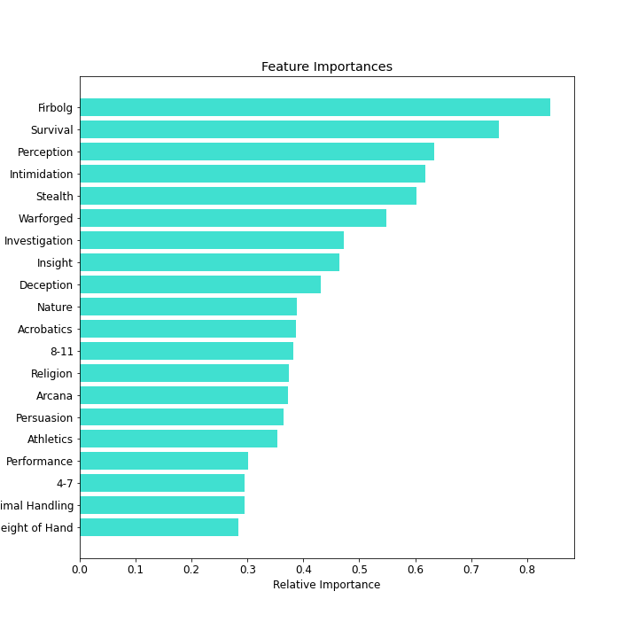
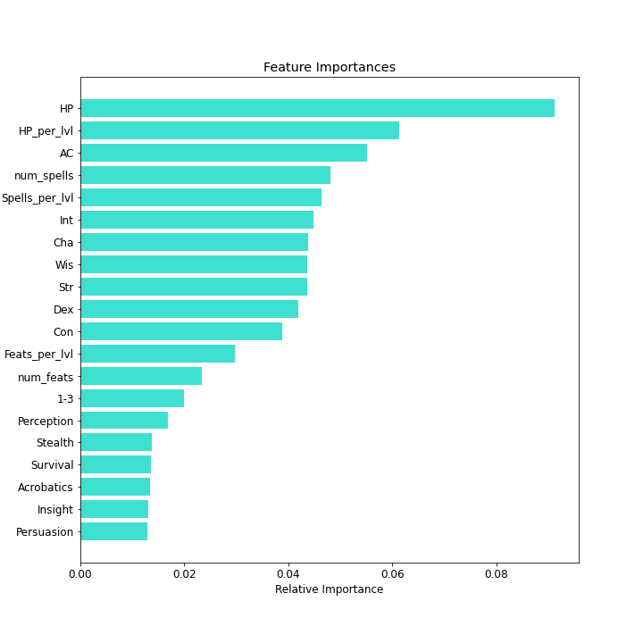

# Interpreting what aspects of a DnD 5e characters indicate that they are multiclassing.

## Abstract:
The overarching goal of this project was to use classification models to interpret what aspects of a character indicates that they have multiclassed. All data was from a DnD enthusiast's git repository from some open-source interactive character sheets they built. An interactive Tableau dashboard was built to better visualize and see how changing parameters changes class distributions. I chose to utilize many of the already numerical features of characters such as HP, AC, level, and ability scores. The rest were one-hot encoded, e.g. race, skills, casting stat, etc. Engineered features were normalized to character level since the dataset is skewed towards lower-level characters.

## Design:
I am interested in building an interpretive classification model that utilizes DnD character sheet data to determine whether a character is multiclassing. The entire goal of this project is to ascertain which features indicate class and how their interactions influence their class.

## Data
All character sheet data was obtained from GitHub user [oganm's](https://github.com/oganm) repository [dnddata](https://github.com/oganm/dnddata). It is a weekly updated dataset of characters that are submitted to his web applications [printSheetApp](https://oganm.com/shiny/printSheetApp/) and [interactiveSheet](https://oganm.com/shiny/interactiveSheet/). He did some exploratory data analysis (EDA) on the dataset to determine rarity of DnD characters in a [dndstats blogpost](https://oganm.github.io/dndstats/). This was based on an article by FiveThirtyEight titled: [Is Your D&D Character Rare?](https://fivethirtyeight.com/features/is-your-dd-character-rare/)

The [**dataset**](https://github.com/oganm/dnddata/blob/master/data-raw/dnd_chars_all.tsv) has 9784 character sheets, with about 19 features. Some of them Oganm processed, such as race, weapons, spells, and alignment. Many were one-hot encoded and categorized to feed into the model. If a list was given, they were separated by |. The features used in the models were the following:
- **level**: total level.
- **AC**: Armor Class score
- **Str, Dex, Con, Int, Wis, Cha**: Ability score modifiers.
- **skills**: List of proficient skills.
- **castingStat**: Casting stat as entered by the user. The format allows one casting stat so this is likely wrong if the character has different spellcasting classes. Also every character has a casting stat even if they are not casters due to the data format.
- **processedRace**: DnD 5e standard races. Some common races that are not natively supported such as warforged and changelings are also included. If the count of the race was 66 or less, then it was categorized as Other Race. 
- **processedSpells**: Standardized spells according to official DnD 5e rules.
- **processedWeapons**: Standardized weapons according to official DnD 5e rules. 
- **levelGroup**: Splits levels into groups. The groups represent the common ASI levels.

## Algorithms:
*Feature Engineering*
1. Cateorical features that were one-hot encoded manually. This includes the following: **skills**, **processedRace**, **levelGroups**, and **castingStat**.
2. Categorical features that were bucketed into main groups, and then manually one-hot encoded. e.g. **processedWeapons** into the sub-categories of simple, martial, and ranged. Minority races were bucketed into an other race category.
3. Features in a list format were simplified to a count of them. These were number of feats and number of spells.
4. The dataset is heavily skewed towards lower levels so HP, spells, and feats were divided by level to get HP per level, spells per level, and feats per level.
5. Whether the characters were multiclassing was determined by checking the lengeth of class data converted into a list. Where 1 was they multiclassed and 0 was only the base-class was used.

*Models*
The classification model algorithms tested for this project were: **Logistic Regression, Random Forest, and Naive Bayes (Bernoulli and Guassian)**. The model evaluation metric of interest was f-1 score. Feature importance rankings were used to determine the impact of novelly added features during refinment. 71 features were ultimately used.

*Model Evaluation and Interpretation*
An 80/20 train-test split was used on the entire dataset of 9784 character sheets. Since multiclassing is not as commonly used, the models were weighted towards the minority class. The Bernoulli Naive Bayes model outpreformed the Guassian one because a majority of the features were categorical instead of continuous. All metrics given are from the test set.  

**Logistic Regression Model weighted:**
- Accuracy = 0.746
- F-1 = 0.418
- Precision = 0.284
- Recall = 0.796
- ROC AUC = 0.767

**Random Forest Model:**
- Accuracy = 0.926
- F-1 = 0.553
- Precision = 0.918
- Recall = 0.396
- ROC AUC = 0.695

**Naive Bayes Bernoulli Model:**
- Accuracy = 0.795
- F-1 = 0.406
- Precision = 0.304
- Recall = 0.609
- ROC AUC = 0.714

*Model/Feature Observations*

Unsurprisingly, the Random Forest model preformed the best while the Naive Bayes model preformed the worst. The Guassian Naive Bayes did not preform as well as the Bernoulli Naive Bayes most likely because the majority of the features were categorical instead of continuous. 

Interestingly, a majority of the top features in the Logistic regression model were skills, such as survival, perception, intimidation, and stealth. Other unexpected results were that the races Firbolg and Warforged were in the top 5 features. Also, level groups 4-7 and 8-11 were within the top 20 which makes sense since players generally choose to multiclass at higher levels. 

In comparison, the Random Forest Model relied mostly on numerical stats, such as AC, HP, and all ability scores (Intelligence, Charisma, Wisdom, Strength, Dexterity, and Constitution). The engineered features of HP per level, feats per level, and spells per level were also in the top 20. This indicates that potentially more engineered features could improve preformance. Still, some skill stats made it into the top 20 features, such as perception, stealth, and survival.

## Tools:
- sklearn, pandas, numpy, and matplotlib
- Tableau and seaborn for visualization
    - To see the interactive dashboard and EDA for the dataset click [here](https://public.tableau.com/app/profile/louisa.reilly/viz/dnd5e_char/DnD_Char?publish=yes).
    
### Sources/Acknowledgements:
- Gary Gygax and Dave Arneson for creating DnD.
- Wizards of the Coast(subsidary of Hasbro) which publishes DnD guides.
- B. Ogan Mancarci for his data collection. [GitRepo](https://github.com/oganm/dnddata)
- Dan Quach for his 2020 [blogpost](https://towardsdatascience.com/classifying-character-classes-in-dungeons-dragons-with-machine-learning-86751240594d) about creating a classifier using Oganm's dataset.